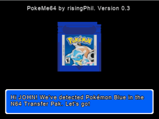
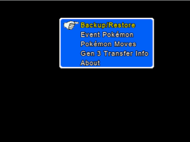
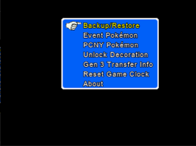

# Introduction

This project lets you acquire past Distribution Event Pokémon in Gen1/Gen2 Pokémon gameboy games specifically using a Nintendo 64 with a Transfer Pak. You can run it by using a flashcart, such as an Everdrive64, ED64Plus and others.

The rom is based on [libpokemegb](https://github.com/risingPhil/libpokemegb) and [libdragon](https://github.com/DragonMinded/libdragon).

Right now the UI is extremely barebones. I aim to improve this in future versions.

I'm happy to accept pull requests if the community wants to do them.

# Current Features
- Inject Generation 1 Distribution event Pokémon into Gen 1 cartridges. In practice, this just means all kinds of variants of Mew.
- Inject Generation 2 Distribution event Pokémon into Gen 2 cartridges. This includes the Pokémon Center New York (PCNY) Distribution event ones.
- Inject GS Ball into an actual Pokémon Crystal gameboy cartridge
- Teach Pikachu Surf/Fly on Gen 1 cartridges

# Limitations
- Right now, this rom only supports the international (English) versions of the games. (as far as I know)

# Build

To build it, set up a [build environment for libdragon](https://github.com/DragonMinded/libdragon/wiki/Installing-libdragon).

\#Build with 12 threads (Change the thread number to what you want):

    libdragon make -j 12

# Usage
WARNING: Do not insert or remove your gameboy cartridge, N64 transfer pak or controller while the Nintendo 64 is powered on. Doing so might corrupt your save file!

- Copy PokeMe64.z64 to your Nintendo 64 flash cartridge. (such as Everdrive64, Super 64, ED64Plus, ...)
- Have your Nintendo 64 powered off. (IMPORTANT)
- Connect your N64 transfer pak to your original (OEM) Nintendo controller. Third party controllers possibly don't work. You can verify this by testing with Pokémon Stadium 1 or 2 first.
- Insert your pokémon gameboy cartridge into your N64 transfer Pak
- Now power on your Nintendo 64
- Load the PokeMe64.z64 rom
- Follow the instructions

# Goal
This project was created to preserve/improve access to the original Distribution event pokémon from Gen1 and Gen2 for actual Pokémon gameboy cartridges. You could kinda do this with a gb operator and a pc.
But having it done with a Nintendo 64 feels more "real"/"official" and is easier if you have the console and Transfer pak.

# Future potential improvements (ideas)
- UI: Make the initial transfer pack detect screen show the gameboy cartridge image of the game that was detected and some kind of icon when there's an error.
- UI: Add stats screen after receiving the pokémon which shows the original gameboy sprite but without the white background.
- UI: In the pokémon list, show the mini menu sprite that you would also see in the party menu in the gameboy games
- UI: add some background images and potentially sprites here and there.
- UI: add some acquisition sound effects from the gameboy games
- UI: add a skippable "trade" 3D animation sequence when you receive a distribution pokémon. The idea is to have a pokéball go into a green mario pipe on either a Nintendo 64 3D model or Nintendo 64 3D logo model. Then follow the pipe with the camera and have the pokéball drop onto a huge 3D representation of the gameboy cartridge before opening the pokéball which then triggers the stats screen.
- UI: Have a 3D intro animation that shows a pokeball opening, a Nintendo 64 logo appearing, slightly jumping and playing the "NINTENDO sixtyfoouuuuuuuuur" meme sound
- UI: Add a menu item to let you buy missing version exclusive pokémon from other versions of the generation with in-game currency. (such as Mankey for Blue or Vulpix for Red). The original games are getting expensive, so this would be a good help for people who can only afford/are willing to buy/play a single game for the generation.
- Support reproduction cartridges (in libpokemegb)
- Support other language versions (in libpokemegb)
- Make it possible to display your cartridge save file as a QR code and contribute to the 3DS' [PKSM](https://github.com/FlagBrew/PKSM) project to migrate the save file easily from gameboy cartridge to 3DS.
- Add Credits screen
- Add a menu item that informs you about the existence of [Poke Transporter GB](https://github.com/GearsProgress/Poke_Transporter_GB) for transferring to Gen3
- Add some background music (Creative commons remakes/remixes of the original music (Maybe a looped chunk of [Ramstar - Route 24](https://www.youtube.com/watch?v=ih53Nb34vbM)?)
- Have a "music" widget that shows up to name the song(s) that I end up using when it/they start(s) playing. (similar to how [Need For Speed - Most Wanted (original)](https://blogger.googleusercontent.com/img/b/R29vZ2xl/AVvXsEhWk37230YvbMHaMchN8dzQiRrO66VofThpcbvUTFMoplDbkQKBVUFcIabbNCnzZ0KpuxcAQmrXQjBlqv_bvi6v6xpjmPxs3tJ-ZI_GhOn3xe5DW7XpMbtnCKFcbBQ-l_zzbrIIV4smBpth/s1600/_mwmusic.jpg) used to show this)

I'm likely going to postpone the 3D stuff (intro and "trade" sequence) until I have implemented a lot of the other ideas here.

Originally I had the idea of showing a professor character in the rom. But then I found out on YouTube that GearsProgress recently released the "Poke transporter GB" which did the exact same thing. So I'm not sure about that idea anymore. Then again, maybe it could be an option to have some lore that these professors would know eachother. Right now this remains unimplemented though.

Anyway, how many of these ideas actually get implemented kinda depends on how quickly I get burned out of the project. We'll see how far we get.

# Help wanted
Hi! I would very much like some people to join the project and add some sprites/graphics design to this rom. I'm not asking you to edit the code for those things. But I don't exactly have the skillset to 
effectively design images or create music.

So if you're good at those things, I would very much appreciate your contributions to bring this project to the next level!

It goes without saying that I'd also happily accept code contributions. :-)

