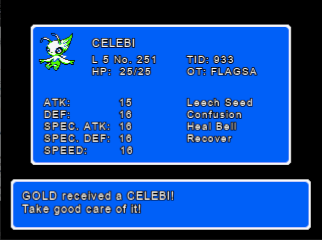
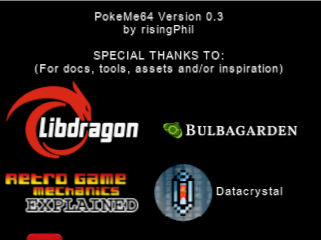

# Introduction

This project lets you acquire past Distribution Event Pokémon in Gen1/Gen2 Pokémon gameboy games specifically using a Nintendo 64 with a Transfer Pak. You can run it by using a flashcart, such as an Everdrive64, ED64Plus and others.

The rom is based on [libpokemegb](https://github.com/risingPhil/libpokemegb) and [libdragon](https://github.com/DragonMinded/libdragon).

Right now the UI is still barebones. I aim to improve this in future versions.

I'm happy to accept pull requests if the community wants to do them.

# Current Features
- Inject Generation 1 Distribution event Pokémon into Gen 1 cartridges. In practice, this just means all kinds of variants of Mew.
- Inject Generation 2 Distribution event Pokémon into Gen 2 cartridges. This includes the Japanese and Pokémon Center New York (PCNY) Distribution event ones!
- Inject GS Ball into an actual Pokémon Crystal gameboy cartridge
- Teach Pikachu Surf/Fly on Gen 1 cartridges
- Gen I move deleter
- You don't have to use the transfer pak in controller 1. You can have it in a separate controller if you want. But the UI is still controlled with controller 1.
- Unlock Mystery Gift decorations like the Pikachu Bed and Tentacool Doll that were left inaccessible in Gold/Silver/Crystal due to bugs in Pokemon Stadium 2 (suggested by /u/MermaidRaccoon on reddit)
- Make it possible to backup your cartridge save file onto the flashcart PokeMe64 is running from.
- Make it possible to restore a save file on the N64 flashcart to an actual Pokémon gameboy cartridge. You can even restore emulator saves!
- Be able to wipe the save file from a game cartridge (mostly added as a feature in case you mess up and restore a save file from a completely different game)
- Make it easy to reset/reconfigure the Generation II game clock

# Limitations
- When using a Korean gen II pokémon game, neither the trainer name (in various screens) nor the pokémon name (in the stats screen) will be displayed in the UI. This is because our font doesn't have the Korean characters and I don't sufficiently care to add them because they're such niche versions.

- When adding a Japanese pokémon to a non-Japanese cart, the trainer name will be replaced with "PokeMe64". This is because the non-japanese games don't include the Japanese character sets, so they can't display them. 

- When adding a non-Japanese pokémon to a Japanese cart, the trainer name will be replaced with "ポケメ64". (which, according to Google Translate, translates to Pokeme 64)

- PokeMe64 also doesn't support batteryless reproduction carts due to technical limitations. Unfortunately this means most reproduction carts can't be supported. (see the "Reproduction carts" section below).

- Flashcarts also unfortunately can't be supported, because those load into a menu first. (and likely also run into the same hardware limitation as with batteryless repro carts)

# Build

To build it, set up a [build environment for libdragon](https://github.com/DragonMinded/libdragon/wiki/Installing-libdragon).

\#Build with 12 threads (Change the thread number to what you want):

    libdragon make -j 12

# Usage
WARNING: Do not insert or remove your gameboy cartridge, N64 transfer pak or controller while the Nintendo 64 is powered on. Doing so might corrupt your save file or just plainly won't work! (header validation check may fail)

- Copy PokeMe64.z64 to your Nintendo 64 flash cartridge. (such as Everdrive64, Super 64, ED64Plus, SummerCart 64, ...)
- Have your Nintendo 64 powered off. (IMPORTANT)
- Connect your N64 transfer pak to your original (OEM) Nintendo controller. Third party controllers possibly don't work. You can verify this by testing with Pokémon Stadium 1 or 2 first.
- Insert your pokémon gameboy cartridge into your N64 transfer Pak
- Now power on your Nintendo 64
- Load the PokeMe64.z64 rom
- Follow the instructions

NOTE: It's been reported that Everdrive 64 users may have to disable the CRC check to get the rom to run. This is a per-game setting you can enable in the Everdrive 64 menu. So far, it's only been reported for Everdrive 64 v3, but it likely applies to other variants as well. (reported by /u/bluemooncinco on reddit)

# Goal
This project was created to preserve/improve access to the original Distribution event pokémon from Gen1 and Gen2 for actual Pokémon gameboy cartridges. You could kinda do this with a gb operator and a pc.
But having it done with a Nintendo 64 feels more "real"/"official" and is easier if you have the console and Transfer pak.

# Future potential improvements (ideas/roadmap)

## UI ideas
- add some background images and potentially sprites here and there.
- add some acquisition sound effects from the gameboy games
- add a skippable "trade" 3D animation sequence when you receive a distribution pokémon. The idea is to have a pokéball go into a green mario pipe on either a Nintendo 64 3D model or Nintendo 64 3D logo model. Then follow the pipe with the camera and have the pokéball drop onto a huge 3D representation of the gameboy cartridge before opening the pokéball which then triggers the stats screen.
- Have a 3D intro animation that shows a pokeball opening, a Nintendo 64 logo appearing, slightly jumping and playing the "NINTENDO sixtyfoouuuuuuuuur" meme sound
- Add a menu item to let you buy missing version exclusive pokémon from other versions of the generation with in-game currency. (such as Mankey for Blue or Vulpix for Red). The original games are getting expensive, so this would be a good help for people who can only afford/are willing to buy/play a single game for the generation.
- Add some background music (Creative commons remakes/remixes of the original music (Maybe a looped chunk of [Ramstar - Route 24](https://www.youtube.com/watch?v=ih53Nb34vbM)?)
- Have a "music" widget that shows up to name the song(s) that I end up using when it/they start(s) playing. (similar to how [Need For Speed - Most Wanted (original)](https://blogger.googleusercontent.com/img/b/R29vZ2xl/AVvXsEhWk37230YvbMHaMchN8dzQiRrO66VofThpcbvUTFMoplDbkQKBVUFcIabbNCnzZ0KpuxcAQmrXQjBlqv_bvi6v6xpjmPxs3tJ-ZI_GhOn3xe5DW7XpMbtnCKFcbBQ-l_zzbrIIV4smBpth/s1600/_mwmusic.jpg) used to show this)

## Feature ideas

- [~~Support batteryless reproduction cartridges~~](docs/Why_I_Had_To_Give_Up_On_Batteryless_Repros.md)
- Make it possible to display your cartridge save file as a QR code and contribute to the 3DS' [PKSM](https://github.com/FlagBrew/PKSM) project to migrate the save file easily from gameboy cartridge to 3DS.
- Make it possible to swap gameboy cartridge after using the reset button on the N64. (suggested by /u/bluemooncinco on reddit)
- Make it possible to delete pokémon moves
- Implement mystery gift.

I'm likely going to postpone the 3D stuff (intro and "trade" sequence) until I have implemented a lot of the other ideas here.

Maybe at some point I might introduce a professor character in PokeMe64. I originally had this idea when starting the project, but when I discovered the existence of the Poke Transporter GB project by GearsProgress, I kinda let that go.

Anyway, how many of these ideas actually get implemented kinda depends on how quickly I get burned out of the project. We'll see how far we get.

# Reproduction carts

Reproduction cartridge support is a bit of a problem for PokeMe64.

The most common ones are "batteryless". Those don't have a battery to hold the save data in SRAM and instead store the save data in unused portions of the ROM. Unfortunately PokeMe64 can't support these due to a Nintendo 64 Transfer Pak hardware limitation.

Battery-backed reproduction carts, however, should theoretically work fine, because their save procedure functions exactly like the original cartridge.

Several posts can be found online about people being successful in converting a batteryless reproduction cartridge to a battery-backed one by soldering a battery and flashing the original (non-batteryless-save-patched) rom to it using a cartridge flasher such as a GBxCart RW.

[I've wrote an article detailing the problem with Batteryless reproduction cartridges](docs/Why_I_Had_To_Give_Up_On_Batteryless_Repros.md)

# Credits
You can find the Credits and special thanks section here: [Credits](CREDITS.md)

# Help wanted
Hi! I would very much like some people to join the project and add some sprites/graphics design to this rom. I'm not asking you to edit the code for those things. But I don't exactly have the skillset to 
effectively design images or create music.

So if you're good at those things, I would very much appreciate your contributions to bring this project to the next level!

It goes without saying that I'd also happily accept code contributions. :-)

